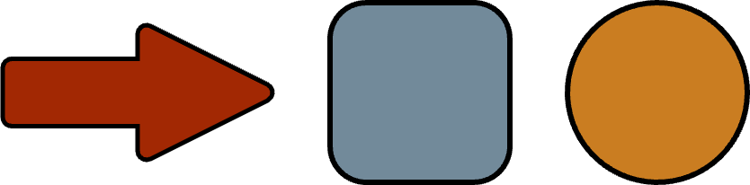
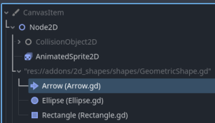
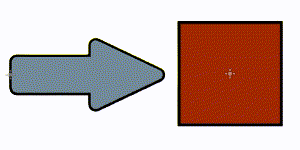
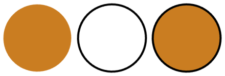

#  2D Shapes 

2D geometric shapes for prototyping and animating in Godot

## Features

- Create rectangles, ellipses, arrows, triangles, stars and regular polygons just by adding a node.

  

- Edit the geometric shapes visually

  

- Select between **Filled**, **Outline** and **Filled + Outline**

  

- Animate properties with Godot's animation system

- Full undo/redo support
